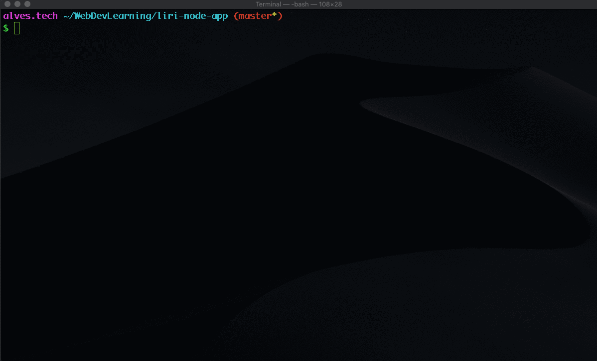
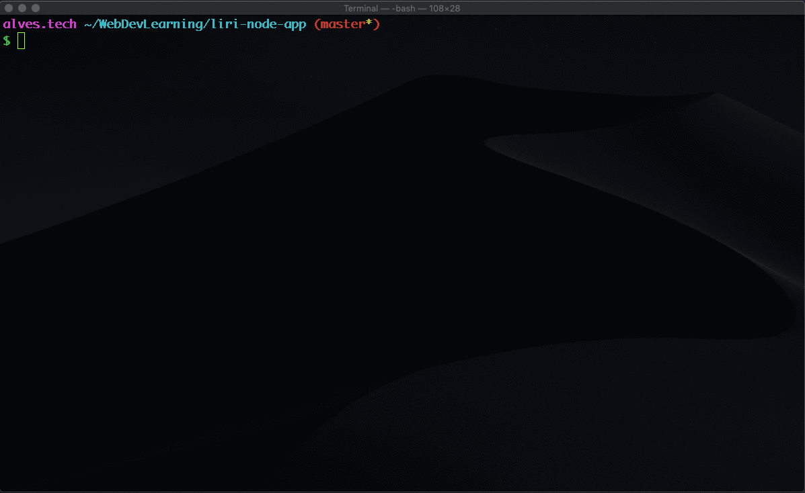
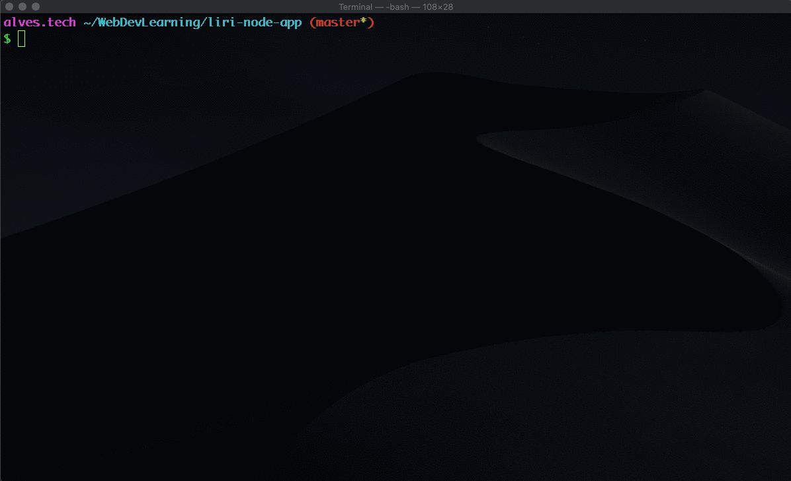

# **Liri App**

## Liri Node App cli program to give back info about Concert, Spotfy Music or movie

Node CLI Application to display some info about given Music Artis or Movie

## SYNOPSIS

`node liri.js <option> [artist|movie]`

## DESCRIPTION

This Application will use the follow APIs:

- [BandsInTown](https://rest.bandsintown.com) API used to get info about concerts of given artits name
- [Spotify](https://developer.spotify.com) API to display info about the given song name
- [OMDB](http://www.imdb.com) API to display info about given movie name

## The options are as follows:

- `concert-this` Will take a Band or Artits name and will display the upcoming concert(s)

  

- `spotify-this-song` Will take a song or artist name and will display info about the muisc(s)

  

- `movie-this` Will take a mivie name and display info about it

  

- `do-what-it-says` Will read a command from random.txt file and run it.

  
